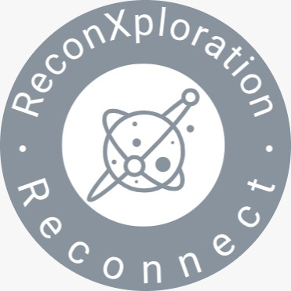
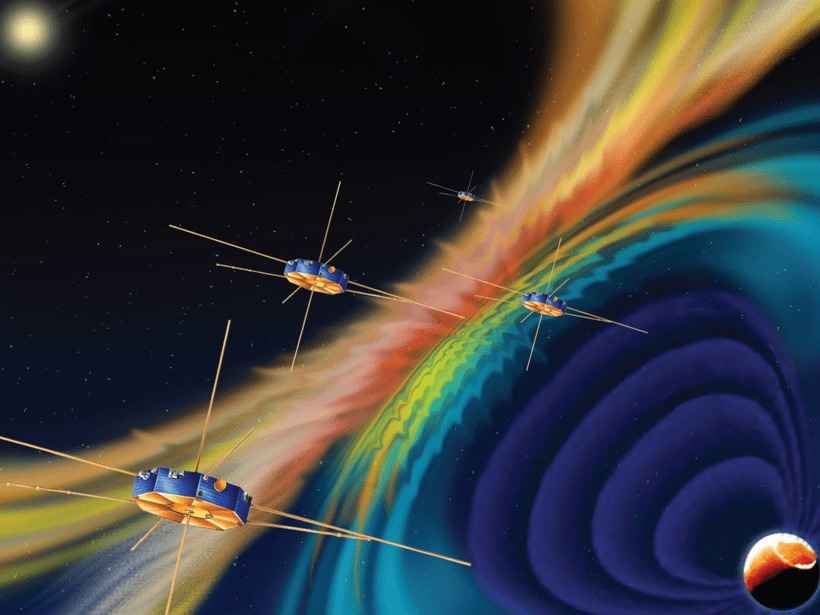
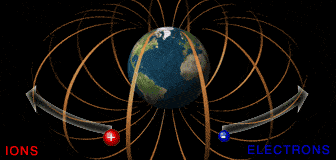
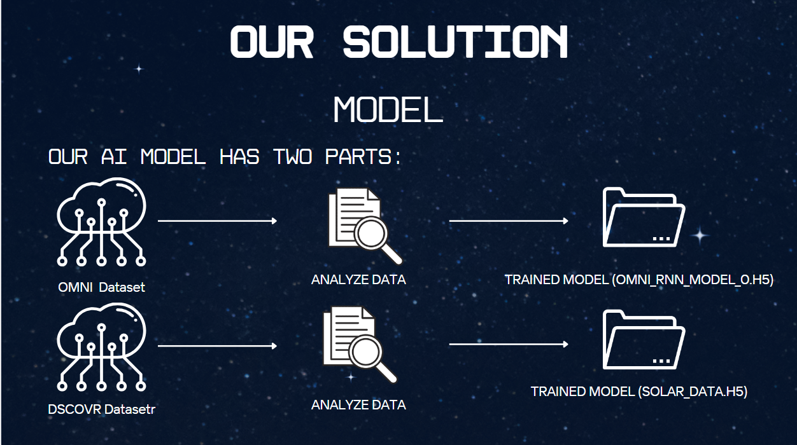
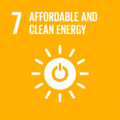
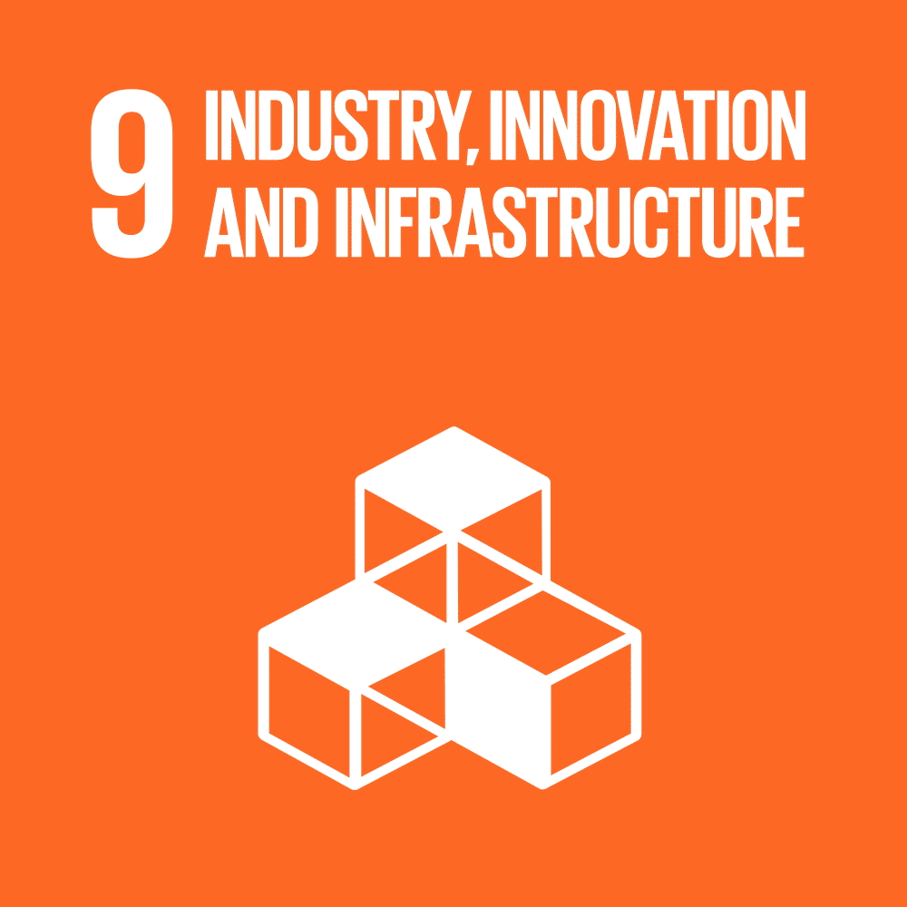
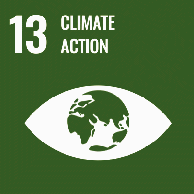
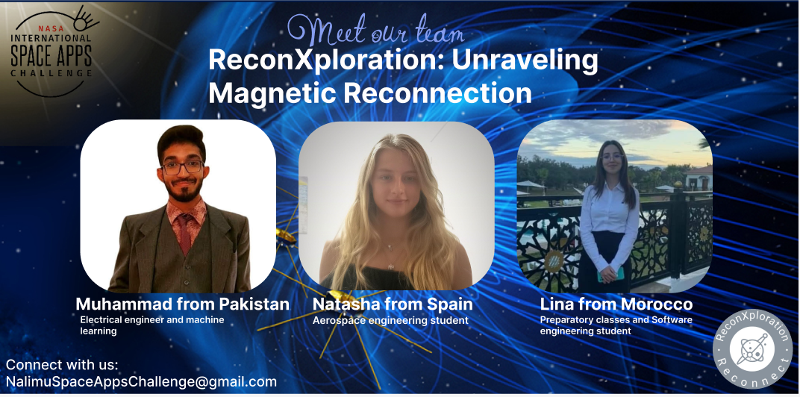

#  
<b>ReconXploration: Unraveling Magnetic Reconnection</b>

Official Submission of Team "ReconXploration:" for NASA Space Apps Challenge 2023 participating in the challenge “Magnetic Reconnection”

## Introduction:

Magnetic reconnection is a process that can occur almost anywhere that a magnetic field is found. In a reconnection event, the magnetic field lines are squeezed together somehow and spontaneously reconfigure themselves. This releases energy. When it occurs near the surface of the Sun, such an event powers giant solar flares that can release thousands of millions of tonnes of electrically charged particles into space.

## Problem statement/solution:

Magnetic reconnection, a natural process in space physics, is not inherently bad but can have adverse effects. It can trigger solar flares and geomagnetic storms, impacting communication systems, power grids, and satellites. Additionally, it poses potential radiation risks to astronauts during space travel.

###  What problem does it solve?

The program addresses the challenge of analyzing complex interplanetary magnetic field (IMF) data from various missions to determine the frequency and impact of magnetic reconnection events, which is critical for understanding solar wind's influence on our space environment. It simplifies this analysis, providing valuable insights into space weather effects for both researchers and the general public.

###  What do people gain?

Users gain a deeper understanding of space weather and its potential effects on technology and daily life, empowering them to make informed decisions and preparations. Scientists benefit from efficient analysis of magnetic reconnection events, enhancing their research on solar wind interactions and aiding in space weather forecasting.

### Where is the opportunity?

The opportunity lies in developing an accessible and robust computer program that translates complex data analysis into actionable insights about magnetic reconnection, fostering an increased understanding of space weather's effects on both the general public and scientific researchers.

## Our working solution:
MAKE THE MAGNETIC RECONNECTION VISIBLE WITH A MODEL SO THAT WE CAN:
- Determine the magnitude of the magnetic field, the speed & and power generated by solar winds.

### OMNI DATA
IN OMNI DATA, WE TRAINED THE MODEL USING RNN (RECURRENT NEURAL NETWORK) BASED UPON LINEAR REGRESSION 
It requires 3 parameters to predict the speed and magnitude of the magnetic fields. Those parameters are:
  - YEAR 
  - PROTON DENSITY 
  - TEMPERATURE

### DSCOVR DATA 
IN DSCOVR DATA, WE TRAINED THE MODEL USING RNN (RECURRENT NEURAL NETWORK) BASED ON LTSM (LONG SHORT-TERM MEMORY)
It only requires speed which is calculated from the OMNI data to calculate the power generated by the solar winds

### AI Model Workflow

### Prototype in action

[![Watch the video]](https://youtu.be/QcWbGMnhHLs?si=ytTfZK-3QAhLqr4q)

## Targeted SDGs:

### SDG 7: Affordable and Clean Energy

Understanding solar wind impacts and their correlation with magnetic field data contributes to the advancement of clean energy technologies and aligns with SDG 7, which seeks to ensure access to affordable, reliable, sustainable, and modern energy for all.

### SDG 9: Industry, Innovation, and Infrastructure:

Creating innovative technologies and infrastructure to analyze space data and understand solar wind impacts aligns with SDG 9, which aims to build resilient infrastructure, promote inclusive and sustainable industrialization, and foster innovation.

### SDG 13: Climate Action:

Studying the solar wind and its effects on the space environment is crucial for understanding climate patterns and potential climate change impacts. This aligns with SDG 13, which focuses on taking urgent action to combat climate change and its impacts.

### SDG 17: Partnerships for the Goals:

Collaboration between space agencies, researchers, and technology developers to create the mentioned program exemplifies partnerships that contribute to the achievement of multiple SDGs. SDG 17 emphasizes the importance of partnerships for sustainable development.

## Into The Future:

### What will your idea change?

It will facilitate informed decision-making, improve space weather forecasting, and contribute to a safer and more prepared approach to potential space weather impacts.

### What can your solution do for the people?

Our solution empowers people to prepare and adapt, ultimately fostering a safer environment in an increasingly technology-dependent world.

## Research Document
[Look at our Research Document, please!](https://docs.google.com/document/d/1_ewDzDcnAc8N9gAm15DYi0qoPa6RER9-76BFv8OcOaU/edit?usp=sharing)

## Presentation Slides
[Look at our presentation slides, please !](https://www.canva.com/design/DAFwJ9aHDQ4/DOlRCSOAgig9s_OOQrHtaw/edit?utm_content=DAFwJ9aHDQ4&utm_campaign=designshare&utm_medium=link2&utm_source=sharebutton)

## Final Video
[*To be a champion, compete; to be a great champion, compete with the best; but to be the greatest champion, compete with yourself*]()

## Our amazing team:

